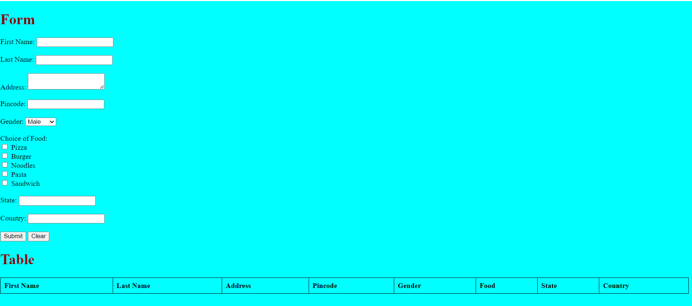

This repository shown the following code Description:

## DOM Manipulation with Forms : ##
### Problem Statement ###
- Create a form and table using HTML,CSS and DOM.
- The form should contain the following fields.
- First name, last name, address, pincode, gender , choice of food(must contain atleast 2 out of 5 options), state, country.
- On submission of the form values, the values must be appended to the table.
- The columns of the table must contain first name, last name, address, pincode, gender,food, state, country.
- Clear the form fields after updating the record in the table.
Include the test suite in your html file which is given below.

## Structure of my code ##

- Create a file with an extension of .html.
- Create a script file with an extension of script.js.

## Output ScreenShot: ##

